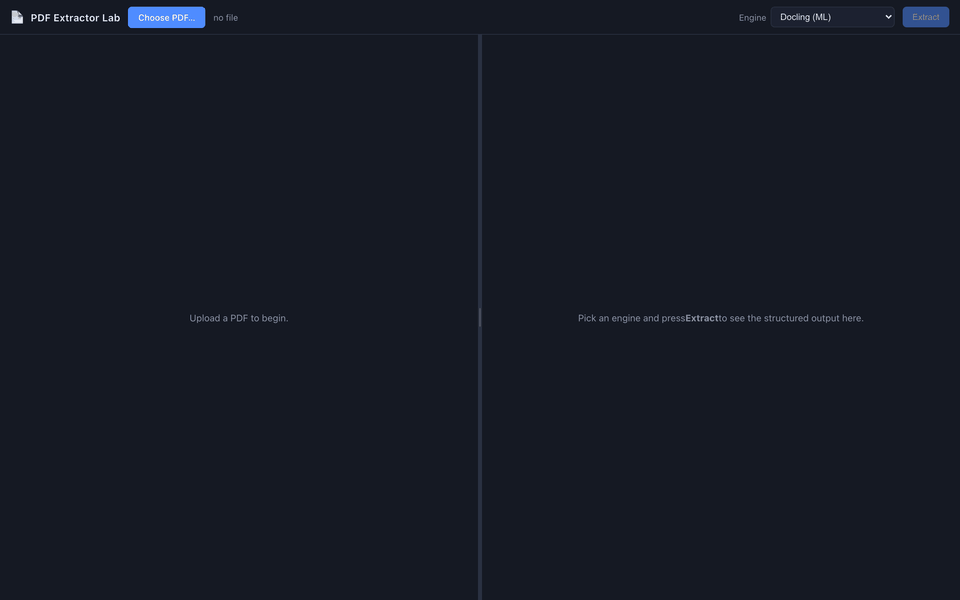

# PDF Extractor Lab

> A visual harness for comparing open-source PDF extractors. Same PDF, seven engines, every detected block painted back onto the page.

<p>
  
  
  
  
  
  
</p>

<p align="center">
  
</p>

## Why this exists

Vendor benchmarks don't answer the questions that matter — speed, segmentation quality, and cost on *your* PDFs. The only honest answer is to run every library on the same input and look at the output side-by-side. This project is the thin FastAPI + React harness that does exactly that. All credit for extraction quality belongs to the upstream libraries.

## Engines

| Engine                  | File                                                                                                       | Upstream                                                                          | License             |
|-------------------------|------------------------------------------------------------------------------------------------------------|-----------------------------------------------------------------------------------|---------------------|
| `basic`                 | [`basic_extractor.py`](backend/app/extractors/basic_extractor.py)                                          | [pdfplumber](https://github.com/jsvine/pdfplumber)                                | MIT                 |
| `pymupdf`               | [`pymupdf_extractor.py`](backend/app/extractors/pymupdf_extractor.py)                                      | [PyMuPDF](https://pymupdf.readthedocs.io/)                                        | AGPL-3.0            |
| `docling`               | [`docling_extractor.py`](backend/app/extractors/docling_extractor.py)                                      | [Docling](https://github.com/docling-project/docling) — DocLayNet + TableFormer   | MIT                 |
| `opendataloader`        | [`opendataloader_extractor.py`](backend/app/extractors/opendataloader_extractor.py)                        | [OpenDataLoader PDF](https://github.com/opendataloader-project/opendataloader-pdf)| Apache-2.0          |
| `opendataloader_hybrid` | [`opendataloader_hybrid_extractor.py`](backend/app/extractors/opendataloader_hybrid_extractor.py)          | ODL Java core + Docling-Fast AI                                                   | Apache-2.0          |
| `vlm`                   | [`vlm_extractor.py`](backend/app/extractors/vlm_extractor.py)                                              | [LiteLLM](https://github.com/BerriAI/litellm) + vision LM                         | depends on provider |
| `agentic`               | [`agentic_extractor.py`](backend/app/extractors/agentic_extractor.py)                                      | [Claude Agent SDK](https://github.com/anthropics/claude-agent-sdk-python)         | depends on provider |

All seven emit the same `ExtractionResult` schema. `GET /engines` returns live availability per engine; the UI greys out anything whose required env vars or binaries are missing. The file → engine mapping is also documented at the top of [`backend/app/extractors/__init__.py`](backend/app/extractors/__init__.py).

## In practice

Each engine has a different opinion on the same page. Use this as a quick map — actual numbers vary by PDF, library version, and (for VLM / agentic) model availability.

| Engine                  | Good at                                                  | Watch out for                                                |
|-------------------------|----------------------------------------------------------|--------------------------------------------------------------|
| `pymupdf`               | Speed — direct text-dict walk, no model loading          | No table support                                             |
| `basic`                 | Simple, transparent pdfplumber baseline                  | Conservative heading detection                               |
| `opendataloader`        | Deterministic rule-based; clean heading levels           | Pure text-layer parser — won't read scanned content          |
| `docling`               | Tables (TableFormer) and reading order                   | Per-line paragraphs; first run downloads ~500 MB of models   |
| `opendataloader_hybrid` | ODL structure + Docling-Fast table pass                  | Auto-spawns its backend on first call (initial latency)      |
| `vlm`                   | Reading messy / scanned layouts a text-layer engine miss | Page-level summary, can hallucinate; per-token cost          |
| `agentic`               | Cross-checks engines; reasoning visible in Trace tab     | Slowest; highest per-document cost                           |

Pick what matches your goal: speed (`pymupdf`), structural fidelity (`opendataloader`, `docling`), or model-driven analysis (`agentic`, `vlm`).

## Quick start

```bash
# Backend
cd backend
python3 -m venv .venv
.venv/bin/pip install -r requirements.txt
cp .env.example .env                    # fill in any keys you need
.venv/bin/uvicorn app.main:app --port 8001 --reload

# Frontend (second terminal)
cd frontend
npm install --legacy-peer-deps        # some React-19 transitive peerDeps still declare React 18
npm run dev                             # http://localhost:5173
```

Prerequisites: Python ≥ 3.10, Node ≥ 20, JDK ≥ 11 (for `opendataloader*`), and an API key for any VLM / agentic engine. The first `docling` run pulls ~500 MB of layout models from HF Hub. Sample PDFs live in [`samples/`](samples/).

## HTTP API

```
GET    /health                   liveness + engine list
GET    /engines                  descriptors with live availability
POST   /upload                   multipart "file"                     → {file_id}
GET    /files/{id}               raw PDF bytes
DELETE /files/{id}               remove uploaded PDF
GET    /pages/{id}/info          page geometry
GET    /pages/{id}/{page}.png    rendered at ?dpi=120 (clamped)
POST   /extract                  form: file_id, engine                → ExtractionResult
```

Every `file_id` is a server-generated 32-char hex; the server rejects any other shape and refuses paths outside `UPLOAD_DIR`.

## Configuration

All settings read from `backend/.env` — see [`backend/.env.example`](backend/.env.example) for the full list. Highlights:

- `CORS_ALLOW_ORIGINS` — lock this to your frontend origin before exposing
- `MAX_UPLOAD_MB`, `RENDER_MAX_DPI` — DoS guards
- `EXPOSE_ERROR_DETAILS` — keep `false` outside local dev
- `VLM_MODEL`, `AGENT_MODEL` — model selection for VLM / agentic engines
- `ODL_*` — OpenDataLoader tunables (table method, reading order, struct tree)
- API keys: `ANTHROPIC_API_KEY`, `GEMINI_API_KEY`

## Adding a new engine

Each engine lives in one self-contained file under [`backend/app/extractors/`](backend/app/extractors/) — see the engines table above for the file → engine mapping. Three small edits and you're done:

1. Write `my_engine_extractor.py` with a class exposing `name` and `async extract(pdf_path) -> ExtractionResult`.
2. Add a lazy loader + one `ExtractorDescriptor` entry to the `_ENGINES` list in [`backend/app/extractors/__init__.py`](backend/app/extractors/__init__.py).
3. That's it — `/engines`, the dropdown, and `/extract` all pick it up automatically.

[`pymupdf_extractor.py`](backend/app/extractors/pymupdf_extractor.py) is the shortest real example to crib from.

## Ideas to explore

PRs welcome. Concrete suggestions:

- **More engines** — [Marker](https://github.com/VikParuchuri/marker), [Unstructured](https://github.com/Unstructured-IO/unstructured), [MinerU](https://github.com/opendatalab/MinerU), [Nougat](https://github.com/facebookresearch/nougat), [Surya](https://github.com/VikParuchuri/surya), [Mistral OCR](https://mistral.ai/news/mistral-ocr).
- **Diff view** — pick two engines, overlay both bboxes, highlight disagreements.
- **Per-page engine override** — different engine per page; mix Docling on the cover with ODL on the tables.
- **Evaluation harness** — TEDS / ANLS / Kendall τ on a gold set; surface a leaderboard.
- **Cost reporting** — show estimated $ before running a VLM / agentic engine.
- **Batch mode** — `POST /extract/batch` for ETL pipelines; emit JSONL.
- **Docker + docker-compose** — one-command reproducible setup.
- **Streaming results** — SSE for agentic / VLM engines so blocks appear as they're produced.

## Repository layout

```
pdf-extract-lab/
├─ backend/app/
│  ├─ main.py           FastAPI app (/upload /extract /pages /files /engines)
│  ├─ schema.py         unified ExtractionResult
│  ├─ config.py         pydantic-settings
│  ├─ extractors/       one *_extractor.py per engine — see Engines table
│  └─ tools/            shared PDF primitives
├─ frontend/src/
│  ├─ App.tsx, api.ts, store.ts
│  └─ components/       UploadBar, PdfPane (bbox overlay), ResultPane (tabs)
├─ samples/             test PDFs
└─ docs/demo.gif        the demo above
```

## Acknowledgements

Thin harness around brilliant work by others:
[pdfplumber](https://github.com/jsvine/pdfplumber),
[PyMuPDF](https://pymupdf.readthedocs.io/),
[Docling](https://github.com/docling-project/docling),
[OpenDataLoader PDF](https://github.com/opendataloader-project/opendataloader-pdf),
[LiteLLM](https://github.com/BerriAI/litellm), and the
[Claude Agent SDK](https://github.com/anthropics/claude-agent-sdk-python).
